# Agent rules → workspace file graph

**Rendered:** [agent-flow.svg](agent-flow.svg) (regenerate from [agent-flow.mmd](agent-flow.mmd) with `npx -y @mermaid-js/mermaid-cli@11 -i docs/agent-flow.mmd -o docs/agent-flow.svg`)

Edges point from a **Cursor rule** (`.cursor/rules/*.mdc`) toward **paths or artifacts** the rule tells the agent to read, write, or use. External systems (Glean, Zendesk, JIRA, etc.) are omitted.

```mermaid
flowchart TD
  subgraph rules["Rules"]
    R_api["api-access-constraints.mdc"]
    R_inv["investigation-workflow.mdc"]
    R_mand["mandatory-outputs.mdc"]
    R_tse["tse-context.mdc"]
    R_zoom["zoom-transcript.mdc"]
    R_esc["escalation-criteria.mdc"]
    R_out["output-standards.mdc"]
    R_cust["communication.mdc"]
    R_risk["risk-assessment.mdc"]
  end

  subgraph files["Workspace paths and artifacts"]
    F_structure["STRUCTURE.md"]
    F_esc_doc["docs/escalation-criteria.md"]
    F_esc_tpl["templates/escalation/escalation-template.md"]
    F_tpl_dir["cases/.template/"]
    F_tpl_notes["cases/.template/notes.md"]
    F_cc_ack["templates/communication/acknowledgment.md"]
    F_cc_req["templates/communication/requesting-info.md"]
    F_cc_sol["templates/communication/solution.md"]
    F_cc_escn["templates/communication/escalation-notice.md"]
    F_cc_zoom["templates/communication/zoom-call.md"]
    F_cc_lead["templates/communication/leadership-summary.md"]
    F_cc_tldr["templates/communication/tldr-handover.md"]
    F_app["app.py"]
    F_env[".env"]
    F_readme["cases/ZD-…/README.md"]
    F_notes["cases/ZD-…/notes.md"]
    F_assets["cases/ZD-…/assets/"]
    F_tx["cases/ZD-…/assets/recordings/*.transcript.txt"]
    F_archive["archive/"]
    F_scripts["scripts/zendesk_client.py"]
    F_solutions["solutions/"]
    F_docs["docs/"]
  end

  R_tse --> F_structure

  R_inv --> F_archive
  R_inv --> F_notes

  R_mand --> F_tpl_notes
  R_mand --> F_cc_zoom
  R_mand --> F_cc_lead
  R_mand --> F_cc_tldr
  R_mand --> F_notes
  R_mand -.->|cross-rule| R_risk

  R_zoom --> F_notes
  R_zoom --> F_tx
  R_zoom --> F_app
  R_zoom --> F_env

  R_esc --> F_esc_doc
  R_esc --> F_readme
  R_esc --> F_notes
  R_esc --> F_app
  R_esc --> F_esc_tpl

  R_out --> F_readme
  R_out --> F_notes
  R_out --> F_assets
  R_out --> F_tpl_dir
  R_out --> F_archive
  R_out --> F_scripts
  R_out --> F_solutions
  R_out --> F_docs

  R_cust --> F_cc_ack
  R_cust --> F_cc_req
  R_cust --> F_cc_sol
  R_cust --> F_cc_escn
  R_cust --> F_cc_zoom
  R_cust --> F_cc_lead
  R_cust --> F_cc_tldr
```

## Rules with no `@` workspace paths

- **api-access-constraints.mdc** — policy only (Zendesk, Atlassian, GitHub, Slack, Glean).
- **risk-assessment.mdc** — checklist only; referenced by **mandatory-outputs.mdc** for change-risk callouts.
